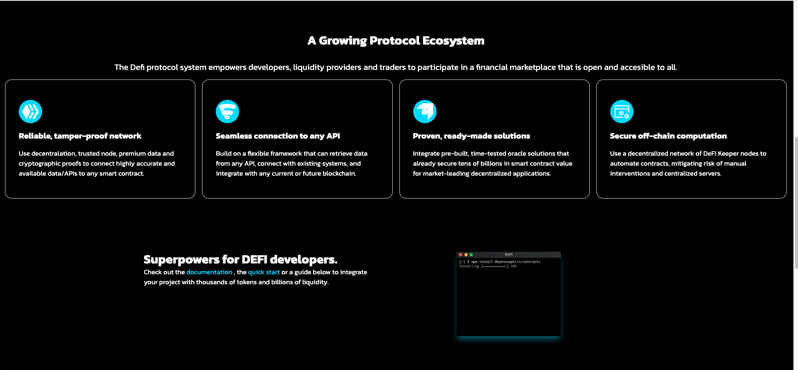
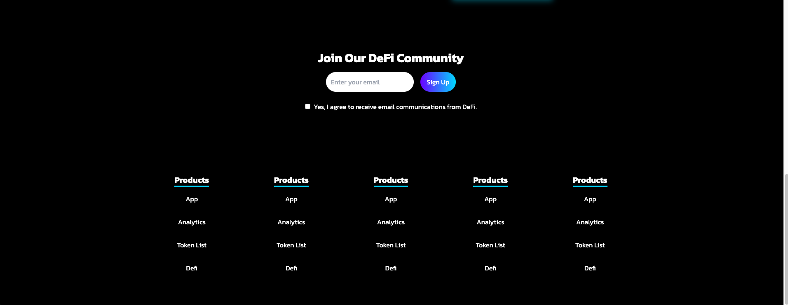

<h1 align="center">
  🧠 Dummy Defi Website App 🧠
</h1>
<h2>
  About :grey_question:
</h2>

  This website is a dummy DEFI website for practicing Tailwind and Typescript.
     

<h2>
  Stack :rocket:
</h2>
<ul>
      <li>React</li>
      <li>Typescript</li>
      <li>Tailwind</li>
      <li>Hooks</li>
</ul>
<h2>
  Screenshots :camera_flash:
</h2>
<h3>
  Main Screen
</h3>

<h3>
  Hero
</h3>

<h3>
  Footer
</h3>

